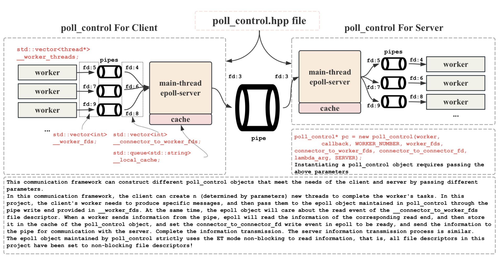

# Event-Driven-Pipeline-Communication-System-Framework


***

<div align="center">
<a href="https://github.com/ffengc">
    
</a>
<a href="https://ffengc.github.io">
    
</a>
<a href="https://ffengc.github.io/gh-blog/">
    
</a>
</div>
<br/>

- [English](./README.md)
- [简体中文](./docs/README-cn.md)

***

- [Event-Driven-Pipeline-Communication-System-Framework](#event-driven-pipeline-communication-system-framework)
  - [📚How to reuse this framework?](#how-to-reuse-this-framework)
  - [🎆Framework](#framework)
  - [🏷️Basic information of the project](#️basic-information-of-the-project)
  - [💻How to run?](#how-to-run)
  - [🧪Experiments with different lambda combinations](#experiments-with-different-lambda-combinations)
  - [📁File directory structure](#file-directory-structure)
  - [Client and server execution process](#client-and-server-execution-process)
  - [`poll_control` core implementation, that is, the implementation of Reactor forwarding service](#poll_control-core-implementation-that-is-the-implementation-of-reactor-forwarding-service)
    - [Explanation of all member variables](#explanation-of-all-member-variables)
    - [Explanation of all member functions](#explanation-of-all-member-functions)
    - [Constructor execution flow](#constructor-execution-flow)
    - [Add a file descriptor to the multiplexer](#add-a-file-descriptor-to-the-multiplexer)
    - [Dispathering](#dispathering)
    - [`__recver`, `__sender` and`__excepter`](#__recver-__sender-and__excepter)
    - [Enable write event care `enable_read_write`](#enable-write-event-care-enable_read_write)
  - [The worker method and callback method provided by the client and server respectively](#the-worker-method-and-callback-method-provided-by-the-client-and-server-respectively)
    - [Client workers and callbacks](#client-workers-and-callbacks)
    - [Server workers and callbacks](#server-workers-and-callbacks)
  - [Set ET mode to non-blocking](#set-et-mode-to-non-blocking)
    - [Basic concept](#basic-concept)
    - [Why does ET mode have to be non-blocking reading?](#why-does-et-mode-have-to-be-non-blocking-reading)
    - [Set the file descriptor to non-blocking](#set-the-file-descriptor-to-non-blocking)
  - [Message structure and sticky packet processing-serialization and deserialization-header implementation](#message-structure-and-sticky-packet-processing-serialization-and-deserialization-header-implementation)
  - [File descriptor encapsulation](#file-descriptor-encapsulation)
  - [`poll.hpp` multiplexing wrapper, `log.hpp` and `thread.hpp` wrapper](#pollhpp-multiplexing-wrapper-loghpp-and-threadhpp-wrapper)
  - [Negative index control](#negative-index-control)


## 📚How to reuse this framework?

This communication framework can be used not only for inter-process communication, but also for other communications such as network services. The specific method is as follows.

- **[reuse.md](./docs/reuse-en.md)**

## 🎆Framework



## 🏷️Basic information of the project

- All functions required by the big job are realized, including the communication between the client and the server. The client starts 3 worker threads (the number can be specified by parameters) to generate specific data, and then transmits them to the epoll service in the pc object in the client through their own pipes. At the same time, the epoll service is already paying attention to the read event at the other end of the pipe, so the worker sends the data to the pipe, and a read event will appear in the epoll service. After the epoll service obtains the data, it will be put into the cache, and then the epoll service will start paying attention to the write event. At this time, the client's epoll service will transfer the data to the server. The data flow process on the server is the same as that on the client. I will explain the details later.
- Production and consumption follow the negative exponential law, and the parameter lambda is specified through the command line parameters of the two processes.
- The program is required to come with a makefile for easy compilation. In addition, according to the manual requirements, the data generated by the producer needs to have process labels and thread labels.
- Encapsulate the log function `./Utils/Log.hpp` and distinguish the log levels. It is convenient for debugging.
- **Through my design, each worker thread is assigned a pipeline, which can achieve lock-free implementation. Combined with the multiplexing performance of epoll, this communication framework is an efficient IO process.**
- **Encapsulate the related operations of epoll in Linux into `./Utils/poll.hpp` to increase the readability of the code.**
- Encapsulates the core object of this project, `class poll_control`. It is essentially a reactor service. Both the client and the server can reuse the code of this object to manage the required threads and the function callbacks that need to be made by the threads. **I think this object is the core of this project. It can avoid writing the logic of controlling threads separately in the client process and the server process, so that the logic of thread control is decoupled from the client and the server, greatly reducing the redundancy of the code and greatly improving the potential for secondary development of the code. The specific core implementation can be seen in `./Utils/poll_control.hpp`.**

## 💻How to run?

clone this repo

```bash
https://github.com/ffengc/Event-Driven-Pipeline-Communication-System-Framework
```

Enter this repository:

```bash
cd Event-Driven-Pipeline-Communication-System-Framework;
```

make

```bash
make clean;make
```

Open the first terminal, enter the server directory and start the server:
```bash
cd Server; ./server 1
```

Open the second terminal, enter the client directory and start the client:
```bash
cd Client; ./client 1
```


## 🧪Experiments with different lambda combinations

- **[exp.md](./docs/exp-en.md)**

## 📁File directory structure

```bash
├── Client/client.cc
├── README.md
├── Server/server.cc
├── Utils
│   ├── comm.hpp, epoll_control.hpp, log.hpp, poll.hpp, thread.hpp
├── makefile
└── temp/use-to-save-fifo-files
```

Among them, `client.cc` is the client main function file, `server.cc` is the server main function file, `comm.hpp` is the definition of some macros, constants and some tool functions, `epoll_control` is the definition of the core object pc object, `log.hpp` is the encapsulation of logs, and `thread.hpp` is the encapsulation of native threads. The `temp` directory is used to store temporary `.ipc` pipe files when the program is running.

## Client and server execution process

**Client**

For the client, first you need to check whether the command line parameters are correct, otherwise output a prompt through `Usage()` and end the process. The next step is to prepare all the file descriptors, which is a very critical step. If the number of workers is set to 3 (the number required by the experimental manual), there are a total of 4 pipes related to the client, one of which is the core pipe used to communicate with the server, and the other three are pipes supporting the worker threads, which are used for communication between the worker and the epoll service in the client. **Therefore, for the client, the client process needs to create 3 named pipes (the server has 4, and the client-server core pipe does not need to be created by the client, the server is responsible for creating it). Therefore, it can be concluded that the client side needs to maintain a total of 7 file descriptors, 6 at both ends of the 3 pipes, and 1 at the write end of the core pipe.**

**As shown in the structure diagram, after the client's pc object is opened, the worker should write to the three fds 5, 7, and 9, and the client's epoll should listen to the read events on the three fds 4, 6, and 8! When the read events 4, 6, and 8 are obtained, the data should be put into the cache, and then the write event of file descriptor fd 3 should be opened.**

The code is shown below.
```cpp
int main(int argc, char** argv) {
    if (argc != 2) {
        Usage();
        exit(1);
    }
    // 0. Extracting command line arguments
    double lambda_arg = std::stod(argv[1]);
    // 1. Get the pipe file and the corresponding file descriptor, a total of 4 pipes, 7 fd
    // 1.1 c->fd of c
    int connector_to_connector_fd = open(ipcPath.c_str(), O_WRONLY | O_NONBLOCK); // Open as written
    //      This pipeline file does not need to be created by the client. The client only needs to create 3 pipelines, and the server needs to create 4 pipelines.
    assert(connector_to_connector_fd >= 0);
    // 1.2 c->w's fd
    auto out = get_client_worker_fifo(WORKER_NUMBER, clientIpcRootPath);
    std::vector<int> worker_fds = out.first;
    std::vector<int> connector_to_worker_fds = out.second;
    // 2. Construct and run the pc object
    poll_control* pc = new poll_control(worker,
        callback, WORKER_NUMBER, worker_fds, connector_to_worker_fds, connector_to_connector_fd, lambda_arg, CLIENT);
    pc->dispather();
    // 3. Close the pipe file
    close(connector_to_connector_fd);
    for (auto e : worker_fds)
        close(e);
    for (auto e : connector_to_worker_fds)
        close(e);
    // 4. Delete the three pipeline files
    delete_fifo(WORKER_NUMBER, clientIpcRootPath);
    return 0;
}
```

For the readability of the code, I encapsulated the function that creates the pipe to generate fd as follows:

```cpp
auto out = get_client_worker_fifo(WORKER_NUMBER, clientIpcRootPath);
```

This function `get_client_worker_fifo` is placed in `comm.hpp`, and the server can also use this code.
`WORKER_NUMBER` is the number of workers, and `clientIpcRootPath` is the path where this pipeline file should be stored.

```cpp
std::string serverIpcRootPath = "../temp/server_fifo"; // server_fifo1.ipc, server_fifo2.ipc ...
std::string clientIpcRootPath = "../temp/client_fifo"; // client_fifo1.ipc, client_fifo2.ipc ...
std::vector<int> worker_fds = out.first;
std::vector<int> connector_to_worker_fds = out.second;
```

`get_client_worker_fifo` will generate the corresponding number of pipes according to the number of worker threads, and return a specific number of read and write file descriptors. For details, please refer to the code details and `README.md`. Due to space constraints, I will not explain it here.

After getting the information and file descriptors of the pipes, you can directly construct the pc object and start the reactor forwarding service.

```cpp
poll_control* pc = new poll_control(worker, callback, WORKER_NUMBER, worker_fds, connector_to_worker_fds, connector_to_connector_fd, lambda_arg, CLIENT);
pc->dispather(); // enable dispathering
```

After dispathering is completed, delete the pipe and close the file descriptor accordingly.

**Callback callback and worker callback**

From the above code, we can see that we also need to provide worker callback and callback callback to the pc object. For the worker, it is what the client worker should do: produce data and write it to `worker_fds`. If it is a server worker, it should be: get data from the `worker_fds` pipe and print it out.

For the client callback, it is the logic that needs to be called after the client's epoll read event is ready and the data is obtained. For the client, after the read event is ready and the data has been taken out from `connector_to_worker_fds`, the logic that needs to be done is: throw the data into the cache, and then start the write event ready! The server is the same.

**Server**

The server process is the same as the client process, so I will not repeat it here.

## `poll_control` core implementation, that is, the implementation of Reactor forwarding service

### Explanation of all member variables

- `__epoll __poll` The epoll maintained by the pc object. `__epoll` is the epoll type encapsulated in `epoll.hpp`, which provides epoll-related operations, see Section 1.9 for details.
- `struct epoll_event __revs;` and `int __revs_num;` store the array of ready events and their size.
- `std::unordered_map<int, connection*> __connection_map;` Mapping from fd to the corresponding `connection` type. The reason for encapsulation is shown in [here](#Encapsulation of file descriptors).
- `bool __quit_signal = false;` Controls the signal for the pc object to exit.
- `std::vector<thread*> __worker_threads;` and `size_t __worker_thread_num;` Worker threads and their number.
- `double __lambda;` Negative exponent parameter, negative number control see [here](#Negative number control) as shown.
- `std::unordered_map<std::string, int> __worker_thread_name_fd_map;` Maintains a mapping from worker thread name to corresponding fd, because each worker thread needs to know the corresponding pipe fd.
- `std::vector<int> __worker_fds;` The fd that the worker thread needs to pay attention to.
- `std::vector<int> __connector_to_worker_fds;` The fd that epoll needs to pay attention to communicate with the worker.
- `int __connector_to_connector_fd;` The fd that epoll needs to pay attention to communicate with the core pipe.
- `std::queue<std::string> __local_cache;` The cache maintained by the pc object.
- `callback_t __callback;` callback function passed by server and client.
- `PC_MODE __mode;` is used to determine whether the current one is client or server.
- `size_t __worker_finish_count;` the number of tasks completed by the worker thread, used to control the exit of the pc object.

### Explanation of all member functions

- The constructor is described in Section 1.7.3. The destructor is used to close all file descriptors and release all `connection*` pointers.
- `void dispather()` forwarding function, and `void loop_once()` are described in [here](#Forwarding Service).
- `void __add_connection(int cur_fd, func_t recv_cb, func_t send_cb, func_t except_cb)` adds the file descriptor to the epoll watch list and sets callbacks for the corresponding events to be ready. For details, see [here](#Add a file descriptor to the multiplexer).
- `__recver`, `__sender`, and `__excepter` are the read callbacks, write callbacks, and exception callbacks corresponding to fd ready in the epoll service. Through analysis, we can find that no matter it is the client or the server, the read callback must read data from fd, and the write callback must write data. Therefore, no matter it is the client or the server, the read and write callbacks are the same. You only need to provide fd, and fd will be encapsulated into the `connection` type, so the parameter types of these three functions are all `connection*`. For details, see [here](#__recver-__sender and __excepter implementation).
- `void enable_read_write(connection* conn, bool readable, bool writable)` This is a key function used to start epoll's attention to write events, because in the reactor forwarding service, the default setting is to care about read events instead of write events. For details, see [here](#Enable the care of write events-enable_read_write).
- `bool is_fd_in_map(int sock)` Checks whether this file descriptor is in the connection's mapping table, which is used to determine whether fd is legal.
- (Non-member function) `static bool set_non_block_fd(int fd)` sets a file descriptor to non-blocking mode. Since our reactor service is set to ET mode, fd needs to be set to non-blocking. For details, see [here](#Setting non-blocking in et mode).

### Constructor execution flow

In the constructor `poll_control`, the validity of the input parameters is first checked to ensure that the callback and work functions passed in are not empty, the number of worker threads matches the number of file descriptors, and the mode parameter is non-default. Next, a thread instance is created for each worker thread, and its number and corresponding file descriptor are stored in the map. Then, a multiplexing object is created, and the logic of adding the main connector to the multiplexing object is added according to the mode parameter (client or server). For each worker thread to worker thread connection, appropriate callbacks are also added according to the mode. Finally, a buffer array for storing ready events is initialized. These steps ensure the correct configuration and initialization of the data flow and event management logic in multithreading.

The constructor code is shown below. This is a very important part of the code. Some details can be found in the comments.

```cpp
poll_control(void* (*worker)(void*) = nullptr, // What the worker thread does
    callback_t callback = nullptr, // What the current pc object needs to do
    int worker_number = THREAD_NUM_DEFAULT, // Number of worker threads
    std::vector<int> worker_fds = {}, // The file descriptor of the communication pipe corresponding to the worker thread
    std::vector<int> connector_to_worker_fds = {}, // conn and worker thread communication fd
    int connector_to_connector_fd = 0, // The fd that conn communicates with another conn (the four fds managed by conn all need to be supervised by epoll)
    double lambda = -1,
    PC_MODE mode = -1)
    : __worker_fds(worker_fds)
    , __connector_to_worker_fds(connector_to_worker_fds)
    , __connector_to_connector_fd(connector_to_connector_fd)
    , __poll(0) /* Set poll to non-blocking here */
    , __revs_num(EPOLL_EVENT_MAX_NUM)
    , __worker_thread_num(worker_number)
    , __lambda(lambda)
    , __mode(mode)
    , __callback(callback)
    , __worker_finish_count(0) {
    // 0. Check the validity of legal input parameters
    assert(worker != nullptr && callback != nullptr); // Check callback is not null
    assert(worker_number == worker_fds.size()); // Check whether the number of workers and the number of pipe fds are the same
    assert(worker_number == connector_to_worker_fds.size() && worker_number == worker_fds.size());
    assert(mode != -1);
    // 1. Creating a worker thread
    for (int i = 1; i <= __worker_thread_num; i++) //T hree threads to perform worker tasks
    {
        // fd for each thread
        int cur_fd = worker_fds[i - 1]; 
        __worker_threads.push_back(new thread(i, worker, this)); // Numbering starts at 1, and 0 is reserved for the conn thread
        // The worker only needs to keep writing things to cur_fd.(client)
        // The worker only needs to keep taking things from cur_fd.(server)
        // How to find the corresponding fd in the w thread? To find it through the ec object, the ec object needs to maintain a map, the name of the w thread -> the fd that the w thread should operate
        __worker_thread_name_fd_map[__worker_threads[__worker_threads.size() - 1]->name()] = cur_fd;
        // __worker_thread_name_fd_map[name] is the fd that this worker should operate!
    }
    // 3. conn is the main thread
    // 3. Create a multiplexing object (conn only needs a multiplexing object)
    __poll.create_poll();
    // 3. Add conn_to_conn to epoll, only need to handle the logic of sending (client)
    // Note that if it is the client side __connector_to_connector, it is a write callback, otherwise it is a read callback.
    if (__mode == CLIENT)
        __add_connection(connector_to_connector_fd, nullptr, std::bind(&poll_control::__sender, this, std::placeholders::_1), std::bind(&poll_control::__excepter, this, std::placeholders::_1));
    else if (__mode == SERVER) {
        __add_connection(connector_to_connector_fd, std::bind(&poll_control::__recver, this, std::placeholders::_1), nullptr, std::bind(&poll_control::__excepter, this, std::placeholders::_1));
    } else
        assert(false);
    // 4. Add conn_to_worker to epoll, and only need to handle the logic of getting data from 3 pipes (client)
    for (size_t i = 0; i < __worker_thread_num; ++i) {
        if (__mode == CLIENT)
            __add_connection(connector_to_worker_fds[i], std::bind(&poll_control::__recver, this, std::placeholders::_1), nullptr, std::bind(&poll_control::__excepter, this, std::placeholders::_1));
        else if (__mode == SERVER)
            __add_connection(connector_to_worker_fds[i], nullptr, std::bind(&poll_control::__sender, this, std::placeholders::_1), std::bind(&poll_control::__excepter, this, std::placeholders::_1));
        else
            assert(false);
    }
    // 4. Construct a buffer to get ready events
    __revs = new struct epoll_event[__revs_num];
}
```

### Add a file descriptor to the multiplexer

For a more detailed explanation of this part, please refer to my personal blog: [work_reactor.html](https://ffengc.github.io/gh-blog/blogs/reactor-server/work_reactor.html)

It is easy to understand the parameters here. The upper layer passes `cur_fd`, which indicates which file descriptor epoll needs to care about, and then the three parameters after main correspond to the callback of the method.

```cpp
    void __add_connection(int cur_fd, func_t recv_cb, func_t send_cb, func_t except_cb) {
        // This method can be called for different types of sockets
        // 0. ! First make sock non-blocking!
        poll_control::set_non_block_fd(cur_fd);
        // 1. Construct a conn object and encapsulate sock
        connection* conn = new connection(cur_fd);
        conn->set_callback(recv_cb, send_cb, except_cb);
        conn->__tsvr = this; // Let the conn object point to itself
        // 2. Add cur_fd to poll
        __poll.add_sock_to_poll(cur_fd, EPOLLIN | EPOLLET); // By default, reading is enabled, but writing is disabled.
        // 3. Put the encapsulated conn into the map
        __connection_map.insert({ cur_fd, conn });
    }
```

### Dispathering

For a more detailed explanation of this part, please refer to my personal blog: [work_reactor.html](https://ffengc.github.io/gh-blog/blogs/reactor-server/work_reactor.html)

The dispathering service mainly runs `dispather`, which first starts all worker threads and then calls `loop_once` in a loop.

```cpp
    void dispather() {
        // The input parameters are the upper-level business logic
        for (auto& iter : __worker_threads)
            iter->start();
        while (true && !__quit_signal && __worker_finish_count < __worker_thread_num)
            loop_once();
    }
```
`loop_once` actually performs the epoll_wait operation and then retrieves all ready file descriptors.

```cpp
void loop_once() {
        // Get all ready events into the revs array
        int n = __poll.wait_poll(__revs, __revs_num);
        for (int i = 0; i < n; i++) {
            // 此时就可以去处理已经就绪事件了！
            int cur_fd = __revs[i].data.fd;
            uint32_t revents = __revs[i].events;
            // All exceptions are handled by read and write, so exceptions directly open in and out
            // Read and write will find except!
            if (revents & EPOLLERR)
                revents |= (EPOLLIN | EPOLLOUT);
            if (revents & EPOLLHUP)
                revents |= (EPOLLIN | EPOLLOUT);
            // If in is ready
            if (revents & EPOLLIN) {
                // This event is ready to read - it means data has been seen from the worker's pipeline
                // 1. First determine whether the socket exists in this map
                if (is_fd_in_map(cur_fd) && __connection_map[cur_fd]->__recv_callback != nullptr)
                    __connection_map[cur_fd]->__recv_callback(__connection_map[cur_fd]);
            }
            // If out is ready, it means that cur_fd is the fd of connector->connector
            if (revents & EPOLLOUT) {
                if (is_fd_in_map(cur_fd) && __connection_map[cur_fd]->__send_callback != nullptr)
                    __connection_map[cur_fd]->__send_callback(__connection_map[cur_fd]);
            }
        }
    }
```

Here we need to handle `EPOLLERR` and `EPOLLHUP` events, which often appear in network services and need special handling.

In addition, through `__connection_map`, we can directly find the pointer of the `connection` object corresponding to the ready file descriptor.

### `__recver`, `__sender` and`__excepter`

For a more detailed explanation of this part, please refer to my personal blog: [work_reactor.html](https://ffengc.github.io/gh-blog/blogs/reactor-server/work_reactor.html)

**`__recver`**

Essence: After the epoll read event is ready, read data from a specific fd.

Points to note:
- Because the ET mode is set, it is necessary to read in a loop, and after the loop reading is completed, it will not be blocked, and will trigger `EWOULDBLOCK` and `EAGAIN`. Therefore, if `errno` is set to these two quantities, it means that the reading is completed and the loop is jumped out.
- If `EINTR` is encountered, it means that the CPU is interrupted and you can continue to read, so `continue`.
- If the return value of read is 0, it means that the write end has closed the file descriptor. At this time, the read end should also be closed and exited.
- After the read is successful, it cannot be directly put into the cache, because the sticky packet problem needs to be handled, so it must be put into the `__in_buffer` of this `conneciton` to wait for processing.
- After the sticky packet problem is handled, the packets are thrown into the cache one by one, and then the callback is called to wait for the callback to be processed.

```cpp
    void __recver(connection* conn) {
        // Non-blocking reading, so read in a loop
        const int num = 102400;
        bool is_read_err = false;
        while (true) {
            char buffer[num];
            ssize_t n = read(conn->__fd, buffer, sizeof(buffer) - 1);
            if (n < 0) {
                if (errno == EAGAIN || errno == EWOULDBLOCK) // Reading completed (normal break)
                    break;
                else if (errno == EINTR)
                    continue;
                else {
                    logMessage(ERROR, "recv error, %d:%s", errno, strerror(errno));
                    conn->__except_callback(conn); // Exception occurs, call the exception callback
                    is_read_err = true;
                    break;
                }
            } else if (n == 0) {
                // logMessage(DEBUG, "client %d quit, server close %d", conn->__fd, conn->__fd);
                conn->__except_callback(conn);
                __quit_signal = true;
                is_read_err = true;
                break;
            }
            // Read successfully
            buffer[n] = 0;
            conn->__in_buffer += buffer; // Just put it in the buffer.
        } // end while
        // logMessage(DEBUG, "recv done, the inbuffer: %s", conn->__in_buffer.c_str());
        if (is_read_err == true)
            return;
        // The previous reading is correct
        // Here is the upper-level business logic, if the received message is processed
        // 1. Cut the message and cut out the individual message
        // 2. Call the callback
        // __callback_func(conn, conn->__in_buffer);
        std::vector<std::string> outs = extract_messages(conn->__in_buffer);
        // outs is the cut message, which is thrown into the buffer
        for (auto e : outs)
            conn->__tsvr->__local_cache.push(e);
        // After dropping into the buffer, a very important logic is required, which is to put things into the output out_fd (out_fd and conn->__fd are not the same)
        conn->__tsvr->__callback(conn);
    }
```

**`__sender`**

Essence: After the epoll write event is ready, write data to a specific fd.

Points to note:
- Because it is ET mode, it needs to be sent in a loop. Similarly, it is determined by judging `EAGAIN` and `EWOULDBLOCK` to determine whether it has been sent.
- If it has been sent, it is necessary to manually turn off epoll's concern for write events (under the current fd) and call `enable_read_write`.
- If an error occurs, the callback of except is called, which is the same as before.

```cpp
    void __sender(connection* conn) {
        while (true) {
            ssize_t n = write(conn->__fd, conn->__out_buffer.c_str(), conn->__out_buffer.size());
            if (n > 0) {
                conn->__out_buffer.erase(0, n);
                if (conn->__out_buffer.empty())
                    break;
            } else {
                if (errno == EAGAIN || errno == EWOULDBLOCK)
                    break;
                else if (errno == EINTR)
                    continue;
                else {
                    logMessage(ERROR, "send error, %d:%s", errno, strerror(errno));
                    conn->__except_callback(conn);
                    break;
                }
            }
        }
        // At this point, either the message is sent completely or the conditions for sending are not met. Send next time
        if (conn->__out_buffer.empty())
            conn->__tsvr->enable_read_write(conn, true, false);
        else
            conn->__tsvr->enable_read_write(conn, true, true);
    }
```
**`__excepter`**

After calling the exception callback, just remove epoll's concern for this fd pair.

```cpp
    void __excepter(connection* conn) {
        if (!is_fd_in_map(conn->__fd))
            return;
        // 1. Remove from epoll
        if (!__poll.delete_from_epoll(conn->__fd))
            assert(false);
        // 2. Remove from map
        __connection_map.erase(conn->__fd);
        // 3. close sock/fd
        close(conn->__fd);
        // 4. delete conn
        delete conn;
        logMessage(DEBUG, "__excepter called\n");
    }
```

### Enable write event care `enable_read_write`

```cpp
    void enable_read_write(connection* conn, bool readable, bool writable) {
        uint32_t events = (readable ? EPOLLIN : 0) | (writable ? EPOLLOUT : 0);
        if (!__poll.control_poll(conn->__fd, events))
            logMessage(ERROR, "trigger write event fail");
    }
```
This function will be called after epoll gets a read event and performs a callback. Because in this project, if epoll gets a read event, it will need to write the data to the cache and then send it to another pipe, so it is necessary to allow write events to occur. As mentioned earlier, epoll only cares about read events by default, so write events need to be enabled manually.

## The worker method and callback method provided by the client and server respectively

### Client workers and callbacks

For the client, the worker's job is to produce data according to a certain rule and transmit it to the corresponding file descriptor.
The idea is very simple and can be implemented directly. Use write to write data to the pipeline. Of course, you need to serialize the message and add a header.

```cpp
void* worker(void* args) {
    __thread_data* td = (__thread_data*)args;
    poll_control* pc = (poll_control*)td->__args;
    // Construct Task here
    std::random_device rd;
    std::mt19937 gen(rd());
    std::exponential_distribution<> dist(pc->__lambda); // Here are the parameters passed from the command line
    size_t mesg_number = 0;
    while (true) {
        mesg_number++;
        double interval = dist(gen); // Generates random numbers from a negative exponential distribution
        unsigned int sleepTime = static_cast<unsigned int>(std::floor(interval)); // Negative exponent
        sleep(sleepTime);
        // Here we need to generate a data
        struct message msg;
        msg.mesg_number = mesg_number;
        msg.src_tid = pthread_self();
        memset(msg.data, '0', sizeof(msg.data));
        // Now that the data has been generated, it needs to be sent to conn through a pipeline. So where is the fd of this pipeline?
        std::cout << "generate a mesg[" << mesg_number << "], src_tid: " << msg.src_tid << std::endl;
        int cur_fd = pc->__worker_thread_name_fd_map[td->__name]; // So just put the information into the cur_fd pipe.
        // Before putting the message in, encode it first, customize the protocol!
        std::string encoded = encode(msg) + "\n\r\n"; // "\n\r\n" It is a mark to prevent sticking
        // Write to the pipeline
        write(cur_fd, encoded.c_str(), encoded.size());
        if (mesg_number >= MESG_NUMBER) {
            // Send at most MESG_NUMBER messages
            pc->__worker_finish_count++; // Set exit signal
            break;
        }
    }
    return nullptr;
}
```
For the client callback, after epoll obtains the read event, it puts the thing from the cache into the write pipe, and calls `enable_read_write` to allow the write event to be triggered.

```cpp
void callback(connection* conn) {
    auto& q = conn->__tsvr->__local_cache;
    std::string buffer;
    while (!q.empty()) {
        // Access the element at the front of the queue
        std::string single_msg = q.front();
        buffer += single_msg + "\n\r\n";
        q.pop();
    }
    // At this point, the buffer contains the data to be sent. Which fd is it sending? conn->__tsvr->__connector_to_connector_fd    auto send_conn = conn->__tsvr->__connection_map[conn->__tsvr->__connector_to_connector_fd];
    send_conn->__out_buffer += buffer;
    conn->__tsvr->enable_read_write(send_conn, true, true); // enable write
}
```

### Server workers and callbacks

The server worker gets events from the pipeline and prints them out. The callback is basically the same as the client, but there are slight differences. For the client, epoll only needs to write data to one fd, but for the server, as shown in the structure diagram, it needs to write to three fds evenly. The control logic here is very simple, you can directly look at the code, and I will not explain it here.

## Set ET mode to non-blocking

For a more detailed explanation of this part, please refer to my personal blog: [work_reactor.html](https://ffengc.github.io/gh-blog/blogs/reactor-server/work_reactor.html)

### Basic concept

epoll has two working modes, level trigger (LT) and edge trigger (ET)

- LT mode: If I have your data, I will keep notifying you
- ET mode: I will only notify you when your data arrives for the first time, from nothing to something, or from something to more (change)

**detail:**

Why should I listen to the ET mode? Why should I go immediately? If I don't take it, the bottom layer will no longer notify, and the upper layer call will not be able to obtain the ready event of the fd, and recv can no longer be called, and the data will be lost. Forcing programmers, if the data is ready, they must take all the ready data in this round at once.

Can I temporarily not process the ready data in LT? Yes! Because I still have the opportunity to read it later.

If I also take all the data at once in LT mode, there is no difference in efficiency between LT and ET.

Why is ET mode more efficient?

Fewer return times (after all, one epoll_wait is a kernel to user)

ET mode will force programmers to take all the data in the buffer as soon as possible, and the application layer will take the data in the buffer as soon as possible. Then, in unit time, the server working in this mode can, to a certain extent, send a larger receiving window to the sender, so the other party can have a larger sliding window, send more data to us at a time, and improve IO throughput.

### Why does ET mode have to be non-blocking reading?

Conclusion: et mode must be non-blocking reading. Why?

First, et mode must read all at once! How can I read it all at once? I don't know how much there is, how can I ensure that I can read it all at once? So we have to read continuously, keep reading! Read in a loop! Read until there is no data!

ok! If there is no data, recv will block! This is not okay, we don't allow blocking!

So what should we do? Set this sock to a non-blocking sock. This sock has a feature: keep reading, and don't block when there is no data! Return an error directly, reporting an error: EAGAIN. And this EAGAIN can tell us that we have finished reading!

### Set the file descriptor to non-blocking

You can directly call the system call `fcntl`


```cpp
    static bool set_non_block_fd(int fd) { // The file descriptor is set to a non-blocking file descriptor
        int fl = fcntl(fd, F_GETFL);
        if (fl < 0)
            return false;
        fcntl(fd, F_SETFL, fl | O_NONBLOCK);
        return true;
    }
```

## Message structure and sticky packet processing-serialization and deserialization-header implementation

Message structure:

```cpp
struct message {
    size_t mesg_number;
    uint64_t src_tid; // 8 bytes
    char data[4096]; // 4096 bytes
};
```

Serialization method:

```cpp
std::string encode(const message& msg) {
    std::ostringstream out;
    // Encode mesg_number and src_tid as hexadecimal strings
    out << std::hex << msg.mesg_number << '|' << msg.src_tid << '|';
    // Encode data, handle special characters
    for (int i = 0; i < 4096; i++) {
        if (std::isprint(msg.data[i]) && msg.data[i] != '%') {
            out << msg.data[i];
        } else {
            out << '%' << std::setw(2) << std::setfill('0') << std::hex << (unsigned int)(unsigned char)msg.data[i];
        }
    }
    return out.str();
}
```

Deserialization method:

```cpp
// Deserialization
bool decode(const std::string& serialized, message& msg) {
    std::istringstream in(serialized);
    std::string mesg_number_hex, tid_hex;
    if (!std::getline(in, mesg_number_hex, '|') || !std::getline(in, tid_hex, '|'))
        return false;
    // Parsing mesg_number
    std::istringstream mesg_number_stream(mesg_number_hex);
    mesg_number_stream >> std::hex >> msg.mesg_number;
    // Parsing src_tid
    std::istringstream tid_stream(tid_hex);
    tid_stream >> std::hex >> msg.src_tid;
    // Parsing data
    std::string data;
    std::getline(in, data);
    size_t i = 0, j = 0;
    while (i < data.size() && j < 4096) {
        if (data[i] == '%' && i + 2 < data.size()) {
            std::istringstream hex_char(data.substr(i + 1, 2));
            int value;
            hex_char >> std::hex >> value;
            msg.data[j++] = static_cast<char>(value);
            i += 3; // Skip "%XX"
        } else {
            msg.data[j++] = data[i++];
        }
    }
    return true;
}
```

The message separator is set to: `\n\r\n`

分割报文方法：
```cpp
std::vector<std::string> extract_messages(std::string& buffer) {
    std::vector<std::string> messages;
    std::string delimiter = "\n\r\n";
    size_t pos = 0;
    std::string token;
    while ((pos = buffer.find(delimiter)) != std::string::npos) {
        token = buffer.substr(0, pos);
        messages.push_back(token);
        buffer.erase(0, pos + delimiter.length());
    }
    return messages;
}
```

## File descriptor encapsulation

Why do we need to encapsulate fd:

Because reading is non-blocking, we need to split the message. Because it is non-blocking reading, epoll will read all the messages at once when reading a certain fd! The read byte stream may contain multiple messages, so a buffer is needed to do the task of message splitting. Therefore, each fd needs to be equipped with a buffer. In addition, the callbacks corresponding to the three ready events of each fd should also be integrated, so the fd is encapsulated into the `connection` type. The most important thing about this type is the three callback methods, input buffer and output buffer. There are some other details, such as back pointers, etc.

The encapsulated structure is as follows:

```cpp
class poll_control;
class connection;
using func_t = std::function<void(connection*)>;
using callback_t = std::function<void(connection*)>; // Business logic
/**
* For the client, the callback is responsible for putting the cached content into the out_buffer of the sent file descriptor
* For the server, the callback is to evenly distribute the cached content to the out_buffer of the pipe_fd corresponding to the three worker threads
*/
class connection {
public:
    connection(int fd = -1)
        : __fd(fd)
        , __tsvr(nullptr) { }
    ~connection() { }
    void set_callback(func_t recv_cb, func_t send_cb, func_t except_cb) {
        __recv_callback = recv_cb;
        __send_callback = send_cb;
        __except_callback = except_cb;
    }

public:
    int __fd;
    func_t __recv_callback;
    func_t __send_callback;
    func_t __except_callback;
    std::string __in_buffer;
    std::string __out_buffer;
    poll_control* __tsvr;
};
```

## `poll.hpp` multiplexing wrapper, `log.hpp` and `thread.hpp` wrapper

You can look at the code directly. Here are some relatively simple encapsulations.

## Negative index control

Use C++11 random number generation methods for control.

```cpp
    std::random_device rd;
    std::mt19937 gen(rd());
    std::exponential_distribution<> dist(pc->__lambda); // Here are the parameters passed from the command line
    double interval = dist(gen); // Generates random numbers from a negative exponential distribution
    unsigned int sleepTime = static_cast<unsigned int>(std::floor(interval)); // Negative exponent
    sleep(sleepTime);
```

This way you can control the logic of negative exponent generation.