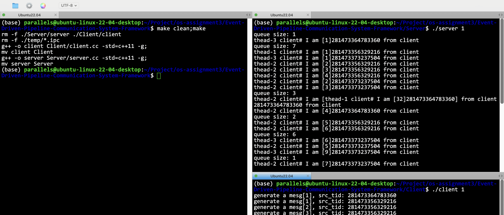
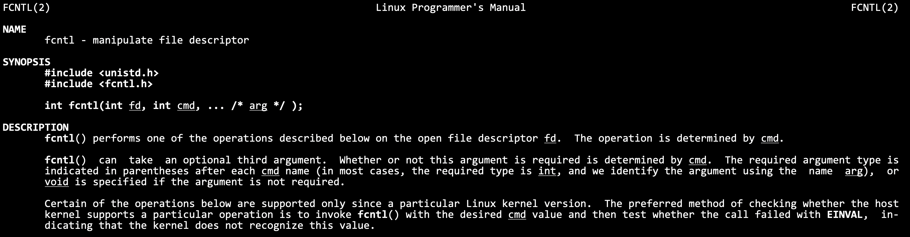

# 基于事件驱动的管道通信系统框架


- [基于事件驱动的管道通信系统框架](#基于事件驱动的管道通信系统框架)
  - [复用该Reactor模式框架的方法](#复用该reactor模式框架的方法)
  - [项目基本框架](#项目基本框架)
  - [项目基本信息](#项目基本信息)
  - [如何运行本项目?](#如何运行本项目)
  - [不同lambda组合实验](#不同lambda组合实验)
  - [文件目录结构](#文件目录结构)
  - [客户端和服务端执行流程](#客户端和服务端执行流程)
  - [`poll_control` 核心实现，即 Reactor 转发服务的实现](#poll_control-核心实现即-reactor-转发服务的实现)
    - [所有成员变量解释](#所有成员变量解释)
    - [所有成员函数解释](#所有成员函数解释)
    - [构造函数执行流程](#构造函数执行流程)
    - [添加文件描述符到多路转接中](#添加文件描述符到多路转接中)
    - [转发服务](#转发服务)
    - [`__recver`, `__sender`和`__excepter`实现](#__recver-__sender和__excepter实现)
    - [开启写事件的关心 `enable_read_write`](#开启写事件的关心-enable_read_write)
  - [client和server分别提供的worker方法和callback方法](#client和server分别提供的worker方法和callback方法)
    - [client的worker和callback](#client的worker和callback)
    - [server的worker和callback](#server的worker和callback)
  - [设置ET模式的非阻塞](#设置et模式的非阻塞)
    - [基本概念](#基本概念)
    - [为什么ET模式一定要是非阻塞的读取才行](#为什么et模式一定要是非阻塞的读取才行)
    - [设置文件描述符为非阻塞](#设置文件描述符为非阻塞)
  - [消息结构和粘包处理-序列化与反序列化-报头实现](#消息结构和粘包处理-序列化与反序列化-报头实现)
  - [文件描述符的封装](#文件描述符的封装)
  - [`poll.hpp`多路转接的封装, `log.hpp`和`thread.hpp`的封装](#pollhpp多路转接的封装-loghpp和threadhpp的封装)
  - [负值数控制](#负值数控制)


## 复用该Reactor模式框架的方法

该通信框架不仅可以适用于进程间通信，还可以用于网络服务等其他通信，具体方法如下文件。

- **[reuse.md](./docs/reuse.md)**

## 项目基本框架


## 项目基本信息

- 实现了大作业要求上的所有功能，包括客户端和服务端的通信，客户端起3个worker线程(可以用参数指定数量)产生特定要求的数据，然后分别通过自己的管道，传输给client中pc对象中的epoll服务中，与此同时，epoll服务已经正在关心管道另一端的读事件了，因此worker把数据发送到管道中，epoll服务中，就会出现一个读事件就绪，epoll服务获取到数据之后，会放到cache中，然后启动epoll服务对写事件的关心，此时，client的epoll服务就会把数据传输到server上。server上的数据流动流程和client端是相同的。具体细节我会在后续讲解。
- 生产和消费按照负指数规律进行，参数lambda通过两个进程的命令行传参指定。
- 程序按照要求带有makefile文件，方便编译。另外按照手册要求，生产者产生的数据需要带有进程标签和线程标签。
- 封装日志功能 `./Utils/Log.hpp`，区分日志的等级。方便debug和调试。
- **通过我这种方式的设计，每一个worker线程分配一个管道，可以做到无锁实现，加上epoll的多路转接性能，这个通信框架是一个高效的IO过程。**
- **封装linux中epoll的相关操作到 `./Utils/poll.hpp`中，增加代码的可读性。**
- 封装该项目的核心对象`class poll_control`。本质上是一个reactor服务。客户端和服务端均可复用这个对象的代码，管理所需要的线程，和线程所对应需要做的函数回调。**这个对象我认为是本次项目的核心所在，它可以避免在客户端进程和服务端进程中，分别编写控制线程的逻辑，使得线程控制的逻辑从客户端和服务端中解耦出来，大大减少代码的冗余，大大提高了代码的二次开发潜力。具体核心实现可以见见 `./Utils/poll_control.hpp`。**

## 如何运行本项目?

克隆这个仓库：
```bash
https://github.com/ffengc/Event-Driven-Pipeline-Communication-System-Framework
```
进入这个仓库：
```bash
cd Event-Driven-Pipeline-Communication-System-Framework;
```
编译：
```bash
make clean;make
```
打开第一个终端，进入server目录启动服务端：
```bash
cd Server; ./server 1
```
打开第二个终端，进入client目录启动客户端：
```bash
cd Client; ./client 1
```



## 不同lambda组合实验

- **[exp.md](./docs/exp.md)**

## 文件目录结构

```bash
├── Client/client.cc
├── README.md
├── Server/server.cc
├── Utils
│   ├── comm.hpp, epoll_control.hpp, log.hpp, poll.hpp, thread.hpp
├── makefile
└── temp/use-to-save-fifo-files
```

其中，`client.cc` 是客户端主函数文件，`server.cc` 是服务端主函数文件，`comm.hpp` 是一些宏，常数和一些工具函数的定义，`epoll_control` 是核心对象 pc 对象的定义，`log.hpp` 是对日志的封装，`thread.hpp` 是对原生线程的封装。`temp` 目录用于存放程序运行时临时的 `.ipc` 管道文件。

## 客户端和服务端执行流程

**客户端**

对于客户端来说，首先需要检查命令行参数熟练是否正确，否则通过 `Usage()` 输出提示，并结束进程。下一步就是准备好所有的文件描述符了，这一步是非常关键的步骤。如果设置worker的数量为3（实验手册要求的数量），则和客户端相关的管道一共有4个，其中一个是用来与server通信的核心管道，另外三个就是worker线程配套的管道了，用于worker和client中的epoll服务进行通信。**因此，对于客户端来说，客户端进程需要创建3个有名管道（服务端是4个，client-server的核心管道不需要client创建，server负责创建）。 因此可以得出结论，client端需要维护的文件描述符共有7个，3个管道的两端共6个，核心管道的写端1个。**

**如结构图所示，当开启了client端的pc对象之后，worker应该向5，7，9三个fd中进行写入，client的epoll应该监听4，6，8三个fd上的读事件！当获取到4，6，8到读事件就绪之后，应该把数据放到cache中，然后开启文件描述符fd为3的写事件就绪。**

代码如下所示。
```cpp
int main(int argc, char** argv) {
    if (argc != 2) {
        Usage();
        exit(1);
    }
    // 0. 提取命令行参数
    double lambda_arg = std::stod(argv[1]);
    // 1. 获取管道文件和对应的文件描述符，一共4个管道，7个fd
    // 1.1 c->c的fd
    int connector_to_connector_fd = open(ipcPath.c_str(), O_WRONLY | O_NONBLOCK); // 按照写的方式打开
    //      这个管道文件不需要client创建，client只需要创建3个管道，server需要创建4个管道
    assert(connector_to_connector_fd >= 0);
    // 1.2 c->w的fd
    auto out = get_client_worker_fifo(WORKER_NUMBER, clientIpcRootPath);
    std::vector<int> worker_fds = out.first;
    std::vector<int> connector_to_worker_fds = out.second;
    // 2. 构造并运行pc对象
    poll_control* pc = new poll_control(worker,
        callback, WORKER_NUMBER, worker_fds, connector_to_worker_fds, connector_to_connector_fd, lambda_arg, CLIENT);
    pc->dispather();
    // 3. 关闭管道文件
    close(connector_to_connector_fd);
    for (auto e : worker_fds)
        close(e);
    for (auto e : connector_to_worker_fds)
        close(e);
    // 4. 删掉三个管道文件
    delete_fifo(WORKER_NUMBER, clientIpcRootPath);
    return 0;
}
```

为了代码的可读性，我封装了创建管道生成fd的函数，如下所示：

```cpp
auto out = get_client_worker_fifo(WORKER_NUMBER, clientIpcRootPath);
```

这个函数`get_client_worker_fifo`放到了`comm.hpp`下，server端也可以使用这一份代码。
`WORKER_NUMBER`是worker的数量，`clientIpcRootPath`是这个管道文件应该存放的路径。

```cpp
std::string serverIpcRootPath = "../temp/server_fifo"; // server_fifo1.ipc, server_fifo2.ipc ...
std::string clientIpcRootPath = "../temp/client_fifo"; // client_fifo1.ipc, client_fifo2.ipc ...
std::vector<int> worker_fds = out.first;
std::vector<int> connector_to_worker_fds = out.second;
```

`get_client_worker_fifo`会根据worker线程的数量，来生成对应数量的管道，并返回特定数量的读端和写端的文件描述符，具体可以见代码细节和`README.md`。由于篇幅原因这里不再解释了。

拿到管道的这些信息和文件描述符之后，就可以直接构造pc对象并开启reactor的转发服务了。

```cpp
poll_control* pc = new poll_control(worker, callback, WORKER_NUMBER, worker_fds, connector_to_worker_fds, connector_to_connector_fd, lambda_arg, CLIENT);
pc->dispather(); // 开启转发
```

执行完转发之后，相应的删除管道，关闭文件描述符即可。

**callback回调和worker回调**

上面的代码可以看到还需要给pc对象提供worker回调和callback回调。对于worker来说，就是client下worker应该做的事情：生产数据，然后写到`worker_fds`中去，如果是server的worker，就应该是：从`worker_fds`的管道中拿数据，然后打印出来。

对于client的callback来说，就是client的epoll读事件就绪，获取到数据之后，需要调用的逻辑。对于client来说，读事件就绪之后，数据已经从`connector_to_worker_fds`拿出来之后，需要做的逻辑：即把数据丢到cache中去，然后启动写事件就绪！server也是同样的。

**服务端**

服务端流程和客户端相同，这里不再重复解释。

## `poll_control` 核心实现，即 Reactor 转发服务的实现

### 所有成员变量解释

- `__epoll __poll` pc对象维护的epoll，`__epoll`是在`epoll.hpp`中封装后的epoll类型，提供了epoll相关的操作，具体见第1.9节。
- `struct epoll_event __revs;` 和 `int __revs_num;` 存储就绪事件的数组及其大小。
- `std::unordered_map<int, connection*> __connection_map;` 从fd到对应的`connection`类型的映射。封装的原因见[here](#文件描述符的封装)所示。
- `bool __quit_signal = false;` 控制pc对象退出的信号。
- `std::vector<thread*> __worker_threads;` 和 `size_t __worker_thread_num;` worker线程及其数量。
- `double __lambda;` 负指数参数，负值数控制见[here](#负值数控制)所示。
- `std::unordered_map<std::string, int> __worker_thread_name_fd_map;` 维护一个从worker线程名称到对应fd的映射，因为每个worker线程需要知道与之对应的管道fd。
- `std::vector<int> __worker_fds;` worker线程需要关注的fd。
- `std::vector<int> __connector_to_worker_fds;` epoll需要关注的与worker通信的fd。
- `int __connector_to_connector_fd;` epoll需要关注的与核心管道通信的fd。
- `std::queue<std::string> __local_cache;` pc对象维护的缓存。
- `callback_t __callback;` server和client传入的回调函数。
- `PC_MODE __mode;` 用于判断当前是client端还是server端。
- `size_t __worker_finish_count;` worker线程完成任务的数量，用于控制pc对象的退出。

### 所有成员函数解释

- 构造函数详解见第1.7.3节，析构函数的作用是关闭所有文件描述符，并释放所有的`connection*`类型指针。
- `void dispather()` 转发功能，和 `void loop_once()` 详解见[here](#转发服务)。
- `void __add_connection(int cur_fd, func_t recv_cb, func_t send_cb, func_t except_cb)` 将文件描述符添加到epoll的关注列表中，并为相应的事件就绪设置回调，详细可见[here](#添加文件描述符到多路转接中)。
- `__recver`, `__sender`, 和 `__excepter` 是epoll服务中fd就绪后对应的读回调、写回调和异常回调。通过分析可以发现，无论是客户端还是服务端，读回调一定是向fd里面读数据，写回调一定是写数据，因此无论是客户端还是服务端，读写回调都是相同的，只需要提供fd即可，而fd会被封装成`connection`类型，因此这三个函数的参数类型都是`connection*`。详细可见[here](#__recver-__sender和__excepter实现)。
- `void enable_read_write(connection* conn, bool readable, bool writable)` 这是一个关键函数，用于启动epoll对写事件的关心，因为在reactor转发服务中，默认设置为关心读事件而不是写事件。详细可见[here](#开启写事件的关心-enable_read_write)。
- `bool is_fd_in_map(int sock)` 检查这个文件描述符是否在connection的映射表中，用于判断fd是否合法。
- （非成员函数）`static bool set_non_block_fd(int fd)` 将一个文件描述符设置为非阻塞模式，因为我们的reactor服务设置为ET模式，因此需要将fd设置为非阻塞，详细可见[here](#设置et模式的非阻塞)。

### 构造函数执行流程

在构造函数 `poll_control` 中，首先进行输入参数的合法性检查，确保传入的回调和工作函数非空，工作线程的数量与文件描述符的数量匹配，且模式参数非默认值。接下来，为每个工作线程创建线程实例，将其编号和对应的文件描述符存储在映射中。然后，创建多路复用对象，根据模式参数（客户端或服务器）添加主连接器到多路复用对象中的逻辑。对于每个工作线程到工作线程的连接，也根据模式添加适当的回调。最后，初始化一个用于存储就绪事件的缓冲区数组。这些步骤确保了多线程中的数据流和事件管理逻辑的正确配置和初始化。

构造函数代码如下所示，这是很重要的一部分代码，其中的一些细节可以看注释。

```cpp
poll_control(void* (*worker)(void*) = nullptr, // worker 线程要做的事
    callback_t callback = nullptr, // 当前pc对象要做的事情
    int worker_number = THREAD_NUM_DEFAULT, // worker 线程个数
    std::vector<int> worker_fds = {}, // worker线程对应的通信管道的文件描述符
    std::vector<int> connector_to_worker_fds = {}, // conn和worker线程通信的fd
    int connector_to_connector_fd = 0, // conn和另一个conn通信的fd (conn管理的4个fd，都需要交给epoll来监管)
    double lambda = -1,
    PC_MODE mode = -1)
    : __worker_fds(worker_fds)
    , __connector_to_worker_fds(connector_to_worker_fds)
    , __connector_to_connector_fd(connector_to_connector_fd)
    , __poll(0) /* 这里给poll设置非阻塞 */
    , __revs_num(EPOLL_EVENT_MAX_NUM)
    , __worker_thread_num(worker_number)
    , __lambda(lambda)
    , __mode(mode)
    , __callback(callback)
    , __worker_finish_count(0) {
    // 0. 检查合法输入参数合法性
    assert(worker != nullptr && callback != nullptr); // 检查回调非空
    assert(worker_number == worker_fds.size()); // 检查worker数量和管道fd数量是否相同
    assert(worker_number == connector_to_worker_fds.size() && worker_number == worker_fds.size());
    assert(mode != -1);
    // 1. 创建worker线程
    for (int i = 1; i <= __worker_thread_num; i++) // 三个线程去进行worker任务
    {
        // 每个线程的fd
        int cur_fd = worker_fds[i - 1]; // 记得i-1
        __worker_threads.push_back(new thread(i, worker, this)); // 编号从1开始，0留给conn线程
        // worker只需要不断向cur_fd里面写东西就行了(client)
        // worker只需要不断向cur_fd里面拿东西就行了(server)
        // w线程里面如何找到对应的fd? 要通过ec对象来找，因此ec对象要维护一个map，w线程的名字->w线程应该操作的fd
        __worker_thread_name_fd_map[__worker_threads[__worker_threads.size() - 1]->name()] = cur_fd;
        // __worker_thread_name_fd_map[name] 就是这个worker应该操作的fd!
    }
    // 3. conn就是主线程，不是由
    // 3. 创建多路转接对象(conn才需要多路转接对象)
    __poll.create_poll();
    // 3. 添加conn_to_conn到epoll中，只需要处理发的逻辑(client)
    // 注意区分，如果是client端__connector_to_connector是写回调，否则是读
    if (__mode == CLIENT)
        __add_connection(connector_to_connector_fd, nullptr, std::bind(&poll_control::__sender, this, std::placeholders::_1), std::bind(&poll_control::__excepter, this, std::placeholders::_1));
    else if (__mode == SERVER) {
        __add_connection(connector_to_connector_fd, std::bind(&poll_control::__recver, this, std::placeholders::_1), nullptr, std::bind(&poll_control::__excepter, this, std::placeholders::_1));
    } else
        assert(false);
    // 4. 添加conn_to_worker到epoll中，只需要处理从3个管道拿数据的逻辑(client)
    for (size_t i = 0; i < __worker_thread_num; ++i) {
        if (__mode == CLIENT)
            __add_connection(connector_to_worker_fds[i], std::bind(&poll_control::__recver, this, std::placeholders::_1), nullptr, std::bind(&poll_control::__excepter, this, std::placeholders::_1));
        else if (__mode == SERVER)
            __add_connection(connector_to_worker_fds[i], nullptr, std::bind(&poll_control::__sender, this, std::placeholders::_1), std::bind(&poll_control::__excepter, this, std::placeholders::_1));
        else
            assert(false);
    }
    // 4. 构建一个获取就绪事件的缓冲区
    __revs = new struct epoll_event[__revs_num];
}
```

### 添加文件描述符到多路转接中

这一部分更详细的解释可以参考我的个人博客：[work_reactor.html](https://ffengc.github.io/gh-blog/blogs/reactor-server/work_reactor.html)

很容易理解这里的参数，上层传递`cur_fd`，表示需要epoll关心哪一个文件描述符，然后后main三个参数对应就是方法的回调。

```cpp
    void __add_connection(int cur_fd, func_t recv_cb, func_t send_cb, func_t except_cb) {
        // 不同种类的套接字都可以调用这个方法
        // 0. ！先把sock弄成非阻塞！
        poll_control::set_non_block_fd(cur_fd);
        // 1. 构建conn对象，封装sock
        connection* conn = new connection(cur_fd);
        conn->set_callback(recv_cb, send_cb, except_cb);
        conn->__tsvr = this; // 让conn对象指向自己
        // 2. 添加cur_fd到poll中
        __poll.add_sock_to_poll(cur_fd, EPOLLIN | EPOLLET); // 默认开启读，但是不开写
        // 3. 把封装好的conn放到map里面去
        __connection_map.insert({ cur_fd, conn });
    }
```

### 转发服务

这一部分更详细的解释可以参考我的个人博客：[work_reactor.html](https://ffengc.github.io/gh-blog/blogs/reactor-server/work_reactor.html)

转发服务主要就是运行 `dispather`，它首先会先启动所有worker线程，然后循环调用 `loop_once`。

```cpp
    void dispather() {
        // 输入参数是上层的业务逻辑
        for (auto& iter : __worker_threads)
            iter->start();
        while (true && !__quit_signal && __worker_finish_count < __worker_thread_num)
            loop_once();
    }
```
`loop_once` 其实就是进行epoll_wait的操作，然后捞取所有就绪的文件描述符。

```cpp
void loop_once() {
        // 捞取所有就绪事件到revs数组中
        int n = __poll.wait_poll(__revs, __revs_num);
        for (int i = 0; i < n; i++) {
            // 此时就可以去处理已经就绪事件了！
            int cur_fd = __revs[i].data.fd;
            uint32_t revents = __revs[i].events;
            // 将所有的异常，全部交给read和write来处理，所以异常直接打开in和out
            // read和write就会找except了！
            if (revents & EPOLLERR)
                revents |= (EPOLLIN | EPOLLOUT);
            if (revents & EPOLLHUP)
                revents |= (EPOLLIN | EPOLLOUT);
            // 如果in就绪了
            if (revents & EPOLLIN) {
                // 这个事件读就绪了 - 说明从worker的管道中看到了数据
                // 1. 先判断这个套接字是否在这个map中存在
                if (is_fd_in_map(cur_fd) && __connection_map[cur_fd]->__recv_callback != nullptr)
                    __connection_map[cur_fd]->__recv_callback(__connection_map[cur_fd]);
            }
            // 如果out就绪了 说明这个cur_fd是connector->connector的fd
            if (revents & EPOLLOUT) {
                if (is_fd_in_map(cur_fd) && __connection_map[cur_fd]->__send_callback != nullptr)
                    __connection_map[cur_fd]->__send_callback(__connection_map[cur_fd]);
            }
        }
    }
```

这里需要处理 `EPOLLERR`和`EPOLLHUP` 事件，这两种时间在网络服务中经常出现，需要特殊处理一下。

另外，通过`__connection_map`可以直接找到就绪文件描述符对应的`connection`对象的指针。

### `__recver`, `__sender`和`__excepter`实现

这一部分更详细的解释可以参考我的个人博客：[work_reactor.html](https://ffengc.github.io/gh-blog/blogs/reactor-server/work_reactor.html)

**`__recver`**

本质：epoll读事件就绪后，向特定fd中读取数据。

需要注意的点：
- 因为设置了ET模式，所以需要循环读取，而且循环读取到结束之后，是不会阻塞的，会触发`EWOULDBLOCK`和`EAGAIN`，因此如果`errno`被设置成了这两个量，表示读取结束，跳出循环
- 如果遇到了`EINTR`，则表示CPU被中断，可以继续读取，所以`continue`。
- 如果read的返回值是0，表示写端关闭了文件描述符，此时读端也应该关闭，并退出。
- 读取成功之后，不能直接放到cache里面，因为要处理粘包问题，所以要先放到这个`conneciton`的`__in_buffer`里面去等待处理。
- 等处理好粘包问题之后，把一个一个报文丢到cache里，然后调用callback，等待回调的处理。

```cpp
    void __recver(connection* conn) {
        // 非阻塞读取，所以要循环读取
        const int num = 102400;
        bool is_read_err = false;
        while (true) {
            char buffer[num];
            ssize_t n = read(conn->__fd, buffer, sizeof(buffer) - 1);
            if (n < 0) {
                if (errno == EAGAIN || errno == EWOULDBLOCK) // 读取完毕了(正常的break)
                    break;
                else if (errno == EINTR)
                    continue;
                else {
                    logMessage(ERROR, "recv error, %d:%s", errno, strerror(errno));
                    conn->__except_callback(conn); // 异常了，调用异常回调
                    is_read_err = true;
                    break;
                }
            } else if (n == 0) {
                // logMessage(DEBUG, "client %d quit, server close %d", conn->__fd, conn->__fd);
                conn->__except_callback(conn);
                __quit_signal = true;
                is_read_err = true;
                break;
            }
            // 读取成功了
            buffer[n] = 0;
            conn->__in_buffer += buffer; // 放到缓冲区里面就行了
        } // end while
        // logMessage(DEBUG, "recv done, the inbuffer: %s", conn->__in_buffer.c_str());
        if (is_read_err == true)
            return;
        // 前面的读取没有出错
        // 这里就是上层的业务逻辑，如果对收到的报文做处理
        // 1. 切割报文，把单独的报文切出来
        // 2. 调用回调
        // __callback_func(conn, conn->__in_buffer);
        std::vector<std::string> outs = extract_messages(conn->__in_buffer);
        // outs是切割出来的报文，丢到缓冲区里去
        for (auto e : outs)
            conn->__tsvr->__local_cache.push(e);
        // 丢到缓冲区之后，还需要一个很重要的逻辑，就是要把东西放到输出out_fd(out_fd和conn->__fd不是同一个)
        conn->__tsvr->__callback(conn);
    }
```

**`__sender`**

本质：epoll写事件就绪后，向特定fd中写入数据。

需要注意的点：
- 因为是ET模式，所以要循环发送，同样，通过判断`EAGAIN`和`EWOULDBLOCK`来判断是否发送完。
- 如果发送完了，就要手动关闭epoll对写事件的关心（在当前fd下），调用`enable_read_write`即可。
- 如果出现错误则调用except的回调，这个和之前的一样。

```cpp
    void __sender(connection* conn) {
        while (true) {
            ssize_t n = write(conn->__fd, conn->__out_buffer.c_str(), conn->__out_buffer.size());
            if (n > 0) {
                conn->__out_buffer.erase(0, n);
                if (conn->__out_buffer.empty())
                    break; // 发完了
            } else {
                if (errno == EAGAIN || errno == EWOULDBLOCK)
                    break;
                else if (errno == EINTR)
                    continue;
                else {
                    logMessage(ERROR, "send error, %d:%s", errno, strerror(errno));
                    conn->__except_callback(conn);
                    break;
                }
            }
        }
        // 走到这里，要么就是发完，要么就是发送条件不满足，下次发送
        if (conn->__out_buffer.empty())
            conn->__tsvr->enable_read_write(conn, true, false);
        else
            conn->__tsvr->enable_read_write(conn, true, true);
    }
```
**`__excepter`**

调用异常回调之后，解除epoll对这个fd对关心即可。

```cpp
    void __excepter(connection* conn) {
        if (!is_fd_in_map(conn->__fd))
            return;
        // 1. 从epoll中移除
        if (!__poll.delete_from_epoll(conn->__fd))
            assert(false);
        // 2. 从map中移除
        __connection_map.erase(conn->__fd);
        // 3. close sock
        close(conn->__fd);
        // 4. delete conn
        delete conn;
        logMessage(DEBUG, "__excepter called\n");
    }
```

### 开启写事件的关心 `enable_read_write`

```cpp
    void enable_read_write(connection* conn, bool readable, bool writable) {
        uint32_t events = (readable ? EPOLLIN : 0) | (writable ? EPOLLOUT : 0);
        if (!__poll.control_poll(conn->__fd, events))
            logMessage(ERROR, "trigger write event fail");
    }
```
这个函数会被当epoll获取到读事件后，进行回调后被调用。因为在本项目中，epoll如果获取到了读事件，就会需要把数据写到cache里，然后发送到另一条管道里，因此需要允许写事件的发生。然后前面也提到了epoll是只默认关心读事件的，因此写事件需要手动开启。

## client和server分别提供的worker方法和callback方法

### client的worker和callback

对于client来说，worker的工作就是按照一定规律生产数据，并传输到对应的文件描述符上。
思路是非常简单的，直接实现即可，使用write把数据写到管道中去，当然，需要序列化消息和加上报头。

```cpp
void* worker(void* args) {
    __thread_data* td = (__thread_data*)args;
    poll_control* pc = (poll_control*)td->__args;
    // 在这里构造Task
    std::random_device rd;
    std::mt19937 gen(rd());
    std::exponential_distribution<> dist(pc->__lambda); // 这里用命令行传递过来的参数
    size_t mesg_number = 0;
    while (true) {
        mesg_number++;
        double interval = dist(gen); // 生成符合负指数分布的随机数
        unsigned int sleepTime = static_cast<unsigned int>(std::floor(interval)); // 负指数
        sleep(sleepTime);
        // 这里要生成一条数据
        struct message msg;
        msg.mesg_number = mesg_number;
        msg.src_tid = pthread_self();
        memset(msg.data, '0', sizeof(msg.data));
        // 现在数据已经生成好了，现在需要发给conn，通过管道的方式，那么这个管道的fd在哪？
        std::cout << "generate a mesg[" << mesg_number << "], src_tid: " << msg.src_tid << std::endl;
        int cur_fd = pc->__worker_thread_name_fd_map[td->__name]; // 所以只需要把信息放到cur_fd的管道里面就可以了
        // 在把消息放进去之前，先encode一下，协议定制！
        std::string encoded = encode(msg) + "\n\r\n"; // "\n\r\n" 就是防止粘包的标识
        // 写到管道中去
        write(cur_fd, encoded.c_str(), encoded.size());
        if (mesg_number >= MESG_NUMBER) {
            // 最多发MESG_NUMBER条消息
            pc->__worker_finish_count++; // 设置退出信号
            break;
        }
    }
    return nullptr;
}
```

对于client的callback，就是epoll获取到读事件之后，把东西从cache中放到写管道的过程，并调用 `enable_read_write` 允许写事件触发。

```cpp
void callback(connection* conn) {
    auto& q = conn->__tsvr->__local_cache;
    std::string buffer;
    while (!q.empty()) {
        // 访问队列前端的元素
        std::string single_msg = q.front();
        buffer += single_msg + "\n\r\n";
        q.pop();
    }
    // 此时buffer里就是要发送的数据了，发送的fd是哪个？conn->__tsvr->__connector_to_connector_fd
    auto send_conn = conn->__tsvr->__connection_map[conn->__tsvr->__connector_to_connector_fd];
    send_conn->__out_buffer += buffer;
    conn->__tsvr->enable_read_write(send_conn, true, true); // 允许写!
}
```

### server的worker和callback

server的worker就是从管道中获取事件并打印出来，callback和client基本上是一样的，只是有细微区别。对于client来说，epoll只需要往一个fd中写入数据，但是对于server来说，如结构图所示，需要往3个fd中平均写入，控制这里的逻辑非常简单，可以直接看代码，这里不再解释。

## 设置ET模式的非阻塞

这一部分更详细的解释可以参考我的个人博客：[work_reactor.html](https://ffengc.github.io/gh-blog/blogs/reactor-server/work_reactor.html)

### 基本概念

epoll有两种工作模式，水平触发（LT）和边缘触发（ET）

- LT模式: 如果我手里有你的数据，我就会一直通知 
- ET模式: 只有我手里你数据是首次到达，从无到有，从有到多(变化)的时候，我才会通知你

**细节:**

我为什么要听ET模式的?凭什么要立刻去走？我如果不取，底层再也不通知了，上层调用就 无法获取该fd的就绪事件了，无法再调用recv， 数据就丢失了。倒逼程序员，如果数据就绪， 就必须一次将本轮就绪的数据全部取走。

我可以暂时不处理LT中就绪的数据吗?可以! 因为我后面还有读取的机会。

如果LT模式，我也一次将数据取完的话，LT和ET的效率是没有区别的。

ET模式为什么更高效?

更少的返回次数（毕竟一次epoll_wait都是一次内核到用户）

ET模式会倒逼程序员尽快将缓冲区中的数据全部取走，应用层尽快的去走了缓冲区中的数据，那么在单位时间下，该模式下工作的服务器，就可以在一定程度上，给发送方发送一 个更大的接收窗口，所以对方就可以拥有一个工大的滑动窗 口，一次向我们发送更多的数据，提高IO吞吐。

### 为什么ET模式一定要是非阻塞的读取才行

结论：et模式一定要是非阻塞读取。为什么？

首先，et模式要一次全部读完！怎么才能一次读完呢？我都不知道有多少，怎么保证一次读完？所以我们要连续读，一直读！循环读！读到没有数据为止！

ok！读到没有数据, recv就会阻塞！这就不行了，我们不允许阻塞！

所以怎么办？把这个sock设置成非阻塞的sock，这种sock有个特点：一直读，读到没数据了，不阻塞！直接返回报错，报一个错误：EAGAIN。而这个EAGAIN，可以告诉我们，读完了！

### 设置文件描述符为非阻塞

可以直接调用系统调用`fcntl`



```cpp
    static bool set_non_block_fd(int fd) { // 文件描述符设置为非阻塞的文件描述符
        int fl = fcntl(fd, F_GETFL);
        if (fl < 0)
            return false;
        fcntl(fd, F_SETFL, fl | O_NONBLOCK);
        return true;
    }
```

## 消息结构和粘包处理-序列化与反序列化-报头实现

消息结构：

```cpp
struct message {
    size_t mesg_number;
    uint64_t src_tid; // 8个字节
    char data[4096]; // 4096个字节
};
```

序列化方法：

```cpp
std::string encode(const message& msg) {
    std::ostringstream out;
    // 编码 mesg_number 和 src_tid 为十六进制字符串
    out << std::hex << msg.mesg_number << '|' << msg.src_tid << '|';
    // 编码 data，处理特殊字符
    for (int i = 0; i < 4096; i++) {
        if (std::isprint(msg.data[i]) && msg.data[i] != '%') {
            out << msg.data[i];
        } else {
            out << '%' << std::setw(2) << std::setfill('0') << std::hex << (unsigned int)(unsigned char)msg.data[i];
        }
    }
    return out.str();
}
```

反序列化方法：

```cpp
// 反序列化
bool decode(const std::string& serialized, message& msg) {
    std::istringstream in(serialized);
    std::string mesg_number_hex, tid_hex;
    if (!std::getline(in, mesg_number_hex, '|') || !std::getline(in, tid_hex, '|'))
        return false;
    // 解析 mesg_number
    std::istringstream mesg_number_stream(mesg_number_hex);
    mesg_number_stream >> std::hex >> msg.mesg_number;
    // 解析 src_tid
    std::istringstream tid_stream(tid_hex);
    tid_stream >> std::hex >> msg.src_tid;
    // 解析 data
    std::string data;
    std::getline(in, data); // 读取剩余部分作为 data
    size_t i = 0, j = 0;
    while (i < data.size() && j < 4096) {
        if (data[i] == '%' && i + 2 < data.size()) {
            std::istringstream hex_char(data.substr(i + 1, 2));
            int value;
            hex_char >> std::hex >> value;
            msg.data[j++] = static_cast<char>(value);
            i += 3; // 跳过 "%XX"
        } else {
            msg.data[j++] = data[i++];
        }
    }
    return true;
}
```

报文分割符设置为: `\n\r\n`

分割报文方法：
```cpp
std::vector<std::string> extract_messages(std::string& buffer) {
    std::vector<std::string> messages;
    std::string delimiter = "\n\r\n";
    size_t pos = 0;
    std::string token;
    while ((pos = buffer.find(delimiter)) != std::string::npos) {
        token = buffer.substr(0, pos);
        messages.push_back(token);
        buffer.erase(0, pos + delimiter.length());
    }
    return messages;
}
```

## 文件描述符的封装

为什么需要封装fd:

因为读取是非阻塞的，所以需要对报文做切割处理，因为是非阻塞读取，所以epoll在某个fd进行读取时候是会一次性读完的！读完的字节流可能含有多个报文，因此需要一个缓冲区，来做报文切割的任务，因此每一个fd都需要配套一个缓冲区。除此之外每一个fd的三种就绪事件对应的回调，也应该整合起来，因此把fd封装成 `connection` 类型。这个类型最关键的，就是三种回调方法，输入缓冲区和输出缓冲区。其余还有一些细节，比如回指指针等等。

封装后结构如下所示：

```cpp
class poll_control;
class connection;
using func_t = std::function<void(connection*)>;
using callback_t = std::function<void(connection*)>; // 业务逻辑
/**
 * 对于client来说callback负责把cache的东西，放到发送的文件描述符中的out_buffer里去
 * 对于server来说callback就是把cache的东西，平均分配到3个worker线程对应的pipe_fd的out_buffer里去
 */
class connection {
public:
    connection(int fd = -1)
        : __fd(fd)
        , __tsvr(nullptr) { }
    ~connection() { }
    void set_callback(func_t recv_cb, func_t send_cb, func_t except_cb) {
        __recv_callback = recv_cb;
        __send_callback = send_cb;
        __except_callback = except_cb;
    }

public:
    int __fd; // io的文件描述符
    func_t __recv_callback;
    func_t __send_callback;
    func_t __except_callback;
    std::string __in_buffer; // 输入缓冲区（暂时没有处理二进制流）
    std::string __out_buffer; // 输出缓冲区
    poll_control* __tsvr; // 回指指针
};
```

## `poll.hpp`多路转接的封装, `log.hpp`和`thread.hpp`的封装

可以直接看代码，这里都是一些比较简单的封装。

## 负值数控制

使用C++11随机数生成的方法进行控制。

```cpp
    std::random_device rd;
    std::mt19937 gen(rd());
    std::exponential_distribution<> dist(pc->__lambda); // 这里用命令行传递过来的参数
    double interval = dist(gen); // 生成符合负指数分布的随机数
    unsigned int sleepTime = static_cast<unsigned int>(std::floor(interval)); // 负指数
    sleep(sleepTime);
```

通过这种方法可以控制负指数生成的逻辑。