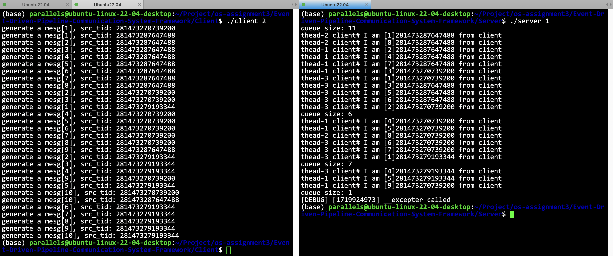
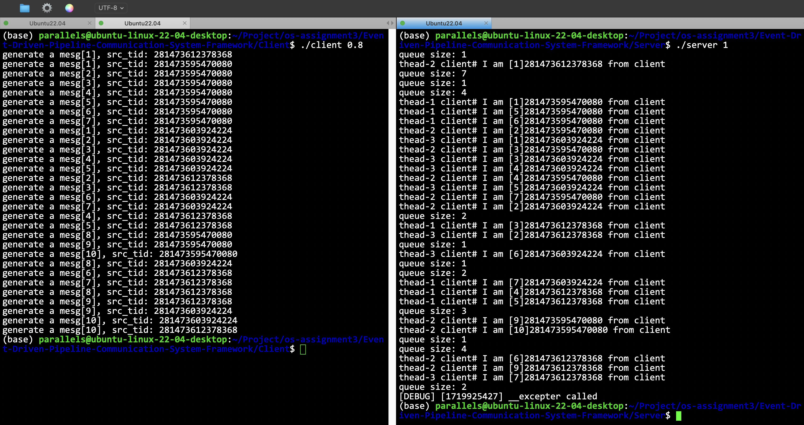

# Experiments with different lambda combinations

- [简体中文](./exp.md)
- [English](./exp-en.md)

In the negative exponential distribution, if the parameter is larger, the number generated by the C++11 generator is smaller, which means that the smaller the time of `sleep()`, the more frequent the event. Secondly, the logic I set is that the server will exit only after the client closes the write end descriptor. Therefore, if the client has sent all the information, it will close the file descriptor of the intermediate pipeline. At this time, regardless of whether the server has read all the data, the server will exit directly. Thirdly, the logic I set is that each worker end of the client will exit by itself after sending 10 messages (a total of 30 messages) (this number can be changed in the configuration file).

**For easy observation, on the server side, I printed the cache size of the pc object for observation and analysis. **

**When the production rate is greater than the consumption rate:**

As shown in the figure, when the production rate is greater than the consumption rate, the cache maintained in the pc object on the server side is always at a high level, which is in line with expectations, because the production rate is very fast, and information is quickly sent from the pipeline and the client, which will cause accumulation on the server side. At the same time, since the producer (client) will close the file descriptor of the intermediate pipeline after producing specific data, it will also cause the server side to be closed accordingly. Therefore, it can be observed that the server side has not read all 30 pieces of data.

**When the production rate is less than the consumption rate:**

As shown in the figure, when the production rate is less than the consumption rate, the cache maintained in the pc object on the server side is always at a low level. This is because the production rate is too slow, and the produced data will be consumed immediately, so there will not be too much data accumulation in the cache. In addition, because the server consumes faster, it can completely consume all the data sent by the client before the client closes the write-end file descriptor.

