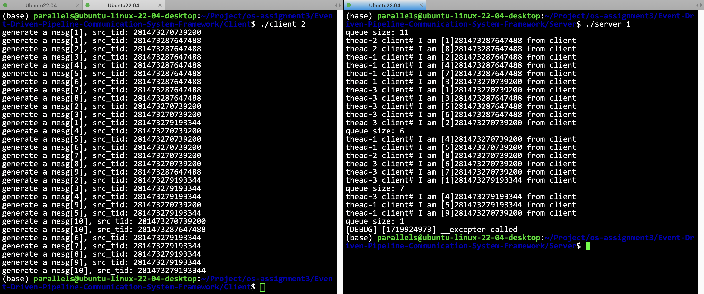
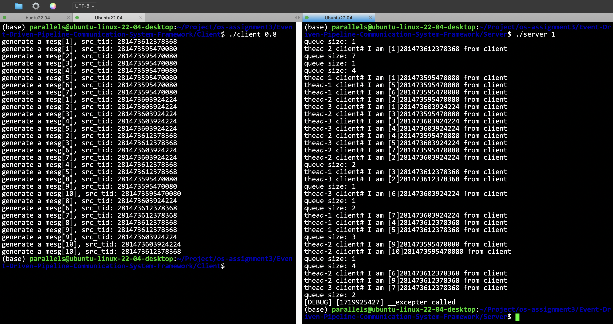

# 不同lambda组合实验

- [简体中文](./exp.md)
- [English](./exp-en.md)

在负指数分布中，如果参数越大，则表示 C++11 生成器生成的数字越小，这意味着 `sleep()` 的时间越小，表示事件越频繁。其次，我设置的逻辑是，server 端会在 client 关闭了写端描述符后，才会退出，因此，如果 client 已经发送完了所有信息，则会关闭中间管道的文件描述符，此时，无论 server 是否读完所有数据，server 都会直接退出。其三，我设置的逻辑是，client 的每一个 worker 端在发送 10 条消息（一共 30 条信息）后，自行退出（这个数字可以在配置文件更改）。

**为了方便观察，在server端，我打印了pc对象的cache缓存大小，用于观察和分析。**

**生产速率大于消费速率时:**

如图所示，当生产速率大于消费速率的时候，server端中pc对象中维护的缓存一直是处于高水平状态，这个也是符合预期的，因为生产速率特别快，信息很快就从管道从客户端发送过来，因此会在服务端导致堆积。与此同时，由于生产者（客户端）在生产完特定数据之后，就会关闭中间管道的文件描述符，因此也会导致server端也会对应的关闭，因此可以观潮到，server端并没有完整读取到了30条数据。

**生产速率小于消费速率:**

如图所示，当生产速率小于消费速率的时候，server端pc对象维护的缓存一直处于较低水平，这是因为生产速率太慢，生产完的数据会立刻被消费，因此缓存不会有太多数据堆积。除此之外，因为server端消费更快，因此可以在client关闭写端文件描述符之前完整地消费所有client发送过来的数据。

